# Workflow examples with R2BEAT 
# Scenario 1
Only a sampling frame containing the units of the population 
of reference is available, no previous round of the sampling survey to be 
planned


```R
# Install last version of R2BEAT and ReGenesees
#install.packages("devtools")
#devtools::install_github("DiegoZardetto/ReGenesees",dependencies = FALSE)
#devtools::install_github("barcaroli/R2BEAT",dependencies=FALSE)
library("R2BEAT")
```

    Caricamento del pacchetto richiesto: plyr
    
    Caricamento del pacchetto richiesto: devtools
    
    Caricamento del pacchetto richiesto: usethis
    
    Caricamento del pacchetto richiesto: sampling
    
    


```R
packageVersion("ReGenesees")
```


    [1] '2.1'


```R
packageVersion("R2BEAT")
```


    [1] '1.0.4'


```R
## Sampling frame
load("pop.RData")
str(pop)
```

    'data.frame':	2258507 obs. of  13 variables:
     $ region       : Factor w/ 3 levels "north","center",..: 1 1 1 1 1 1 1 1 1 1 ...
     $ province     : Factor w/ 6 levels "north_1","north_2",..: 1 1 1 1 1 1 1 1 1 1 ...
     $ municipality : num  1 1 1 1 1 1 1 1 1 1 ...
     $ id_hh        : Factor w/ 963018 levels "H1","H10","H100",..: 1 1 1 2 3 3 3 3 1114 1114 ...
     $ id_ind       : int  1 2 3 4 5 6 7 8 9 10 ...
     $ stratum      : Factor w/ 24 levels "1000","2000",..: 12 12 12 12 12 12 12 12 12 12 ...
     $ stratum_label: chr  "north_1_6" "north_1_6" "north_1_6" "north_1_6" ...
     $ sex          : int  1 2 1 2 1 1 2 2 1 1 ...
     $ cl_age       : Factor w/ 8 levels "(0,14]","(14,24]",..: 3 7 8 5 4 6 6 4 4 1 ...
     $ active       : num  1 1 0 1 1 1 1 1 1 0 ...
     $ income_hh    : num  30488 30488 30488 21756 29871 ...
     $ unemployed   : num  0 0 0 0 0 0 0 0 0 0 ...
     $ inactive     : num  0 0 1 0 0 0 0 0 0 1 ...
    

## Precision constraints


```R

cv <- as.data.frame(list(DOM=c("DOM1","DOM2"),
                         CV1=c(0.02,0.03),
                         CV2=c(0.03,0.06),
                         CV3=c(0.03,0.06),
                         CV4=c(0.05,0.08)))
cv
```


<table class="dataframe">
<caption>A data.frame: 2 × 5</caption>
<thead>
	<tr><th scope=col>DOM</th><th scope=col>CV1</th><th scope=col>CV2</th><th scope=col>CV3</th><th scope=col>CV4</th></tr>
	<tr><th scope=col>&lt;chr&gt;</th><th scope=col>&lt;dbl&gt;</th><th scope=col>&lt;dbl&gt;</th><th scope=col>&lt;dbl&gt;</th><th scope=col>&lt;dbl&gt;</th></tr>
</thead>
<tbody>
	<tr><td>DOM1</td><td>0.02</td><td>0.03</td><td>0.03</td><td>0.05</td></tr>
	<tr><td>DOM2</td><td>0.03</td><td>0.06</td><td>0.06</td><td>0.08</td></tr>
</tbody>
</table>


## Sensitivity analysis


```R
sens_min_SSU <- sensitivity_min_SSU (
             samp_frame=pop,
             errors=cv,
             id_PSU="municipality",
             id_SSU="id_ind",
             strata_var="stratum",
             target_vars=c("income_hh","active","inactive","unemployed"),
             deff_var="stratum",
             domain_var="region",
             delta=1,
             f=0.05,
             deff_sugg=1,
             min=30,
             max=80,
             plot=TRUE)
```

    
    Calculating strata...
    Computations are being done on population data
    
    Number of strata:  24
    ... of which with only one unit:  0
    Calculating rho in strata...
    Stratum  1000
    Stratum  2000
    Stratum  3000
    Stratum  4000
    Stratum  5000
    Stratum  6000
    Stratum  7000
    Stratum  8000
    Stratum  9000
    Stratum  10000
    Stratum  11000
    Stratum  12000
    Stratum  13000
    Stratum  14000
    Stratum  15000
    Stratum  16000
    Stratum  17000
    Stratum  18000
    Stratum  19000
    Stratum  20000
    Stratum  21000
    Stratum  22000
    Stratum  23000
    Stratum  24000
     1  iterations PSU_SR PSU NSR PSU Total  SSU
    1          0      0       0         0 7836
    2          1     50     122       172 8072
    3          2     51     126       177 8071
    
     2  iterations PSU_SR PSU NSR PSU Total  SSU
    1          0      0       0         0 7836
    2          1     31     120       151 8130
    3          2     34     120       154 8127
    
     3  iterations PSU_SR PSU NSR PSU Total  SSU
    1          0      0       0         0 7836
    2          1     27     112       139 8185
    3          2     35     114       149 8177
    
     4  iterations PSU_SR PSU NSR PSU Total  SSU
    1          0      0       0         0 7836
    2          1     25     104       129 8236
    3          2     32     104       136 8231
    
     5  iterations PSU_SR PSU NSR PSU Total  SSU
    1          0      0       0         0 7836
    2          1     25     100       125 8296
    3          2     28     100       128 8297
    
     6  iterations PSU_SR PSU NSR PSU Total  SSU
    1          0      0       0         0 7836
    2          1     19      96       115 8368
    3          2     20     102       122 8364
    
     7  iterations PSU_SR PSU NSR PSU Total  SSU
    1          0      0       0         0 7836
    2          1     19      90       109 8434
    3          2     20      92       112 8434
    
     8  iterations PSU_SR PSU NSR PSU Total  SSU
    1          0      0       0         0 7836
    2          1     23      82       105 8482
    3          2     18      90       108 8489
    
     9  iterations PSU_SR PSU NSR PSU Total  SSU
    1          0      0       0         0 7836
    2          1     20      78        98 8547
    3          2     18      86       104 8552
    
     10  iterations PSU_SR PSU NSR PSU Total  SSU
    1          0      0       0         0 7836
    2          1     20      76        96 8601
    3          2     22      82       104 8598
    
     11  iterations PSU_SR PSU NSR PSU Total  SSU
    1          0      0       0         0 7836
    2          1     16      72        88 8685
    3          2     20      82       102 8655
    


    
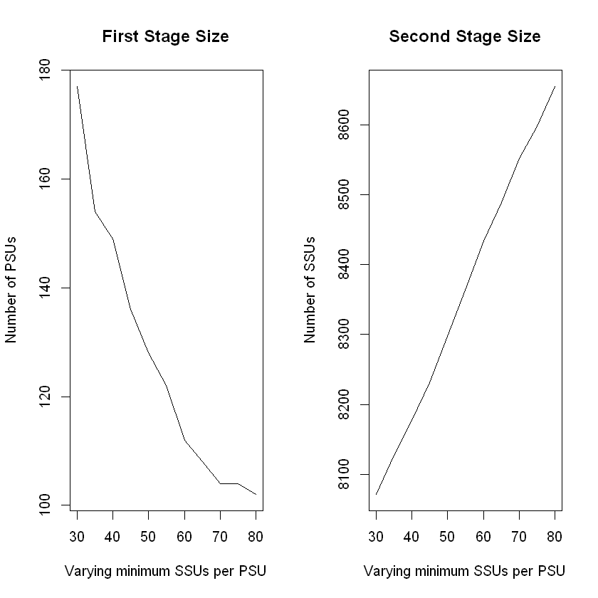
    


## Preparation of inputs for allocation steps


```R
## Preparation of inputs for allocation steps
samp_frame <- pop
samp_frame$one <- 1
id_PSU <- "municipality"  
id_SSU <- "id_ind"        
strata_var <- "stratum"   
target_vars <- c("income_hh","active","inactive","unemployed")   
deff_var <- "stratum"     
domain_var <- "region"  
delta =  1       # households = survey units
minimum <- 50    # minimum number of SSUs to be interviewed in each selected PSU
f = 0.05         # suggestion for the sampling fraction 
deff_sugg <- 1.5 # suggestion for the deff value
 
inp <- prepareInputToAllocation1(samp_frame,
                                id_PSU,
                                id_SSU,
                                strata_var,
                                target_vars,
                                deff_var,
                                domain_var,
                                minimum,
                                delta,
                                f,
                                deff_sugg)
```

    
    Calculating strata...
    Computations are being done on population data
    
    Number of strata:  24
    ... of which with only one unit:  0
    Calculating rho in strata...
    Stratum  1000
    Stratum  2000
    Stratum  3000
    Stratum  4000
    Stratum  5000
    Stratum  6000
    Stratum  7000
    Stratum  8000
    Stratum  9000
    Stratum  10000
    Stratum  11000
    Stratum  12000
    Stratum  13000
    Stratum  14000
    Stratum  15000
    Stratum  16000
    Stratum  17000
    Stratum  18000
    Stratum  19000
    Stratum  20000
    Stratum  21000
    Stratum  22000
    Stratum  23000
    Stratum  24000


```R
head(inp$strata)
```


<table class="dataframe">
<caption>A data.frame: 6 × 14</caption>
<thead>
	<tr><th></th><th scope=col>N</th><th scope=col>M1</th><th scope=col>M2</th><th scope=col>M3</th><th scope=col>M4</th><th scope=col>S1</th><th scope=col>S2</th><th scope=col>S3</th><th scope=col>S4</th><th scope=col>COST</th><th scope=col>CENS</th><th scope=col>DOM1</th><th scope=col>DOM2</th><th scope=col>STRATUM</th></tr>
	<tr><th></th><th scope=col>&lt;dbl&gt;</th><th scope=col>&lt;dbl&gt;</th><th scope=col>&lt;dbl&gt;</th><th scope=col>&lt;dbl&gt;</th><th scope=col>&lt;dbl&gt;</th><th scope=col>&lt;dbl&gt;</th><th scope=col>&lt;dbl&gt;</th><th scope=col>&lt;dbl&gt;</th><th scope=col>&lt;dbl&gt;</th><th scope=col>&lt;dbl&gt;</th><th scope=col>&lt;dbl&gt;</th><th scope=col>&lt;dbl&gt;</th><th scope=col>&lt;dbl&gt;</th><th scope=col>&lt;fct&gt;</th></tr>
</thead>
<tbody>
	<tr><th scope=row>1000</th><td>197007</td><td>23959.87</td><td>0.6650322</td><td>0.2285807</td><td>0.10638708</td><td>22179.08</td><td>0.4719792</td><td>0.4199185</td><td>0.3083324</td><td>1</td><td>0</td><td>1</td><td>2</td><td>1000</td></tr>
	<tr><th scope=row>2000</th><td>261456</td><td>20966.65</td><td>0.6709886</td><td>0.2297519</td><td>0.09925953</td><td>19624.65</td><td>0.4698541</td><td>0.4206732</td><td>0.2990102</td><td>1</td><td>0</td><td>1</td><td>2</td><td>2000</td></tr>
	<tr><th scope=row>3000</th><td>115813</td><td>19814.73</td><td>0.6644591</td><td>0.2315975</td><td>0.10394343</td><td>14754.88</td><td>0.4721792</td><td>0.4218532</td><td>0.3051871</td><td>1</td><td>0</td><td>1</td><td>2</td><td>3000</td></tr>
	<tr><th scope=row>4000</th><td> 17241</td><td>18732.72</td><td>0.6273418</td><td>0.2499275</td><td>0.12273070</td><td>13462.74</td><td>0.4835122</td><td>0.4329708</td><td>0.3281278</td><td>1</td><td>0</td><td>1</td><td>2</td><td>4000</td></tr>
	<tr><th scope=row>5000</th><td>101067</td><td>22070.31</td><td>0.6134445</td><td>0.2338845</td><td>0.15267100</td><td>17187.98</td><td>0.4869603</td><td>0.4232996</td><td>0.3596701</td><td>1</td><td>0</td><td>1</td><td>2</td><td>5000</td></tr>
	<tr><th scope=row>6000</th><td> 47218</td><td>21069.07</td><td>0.6135796</td><td>0.2348469</td><td>0.15157355</td><td>17342.74</td><td>0.4869288</td><td>0.4239031</td><td>0.3586070</td><td>1</td><td>0</td><td>1</td><td>2</td><td>6000</td></tr>
</tbody>
</table>


```R
head(inp$deff)
```


<table class="dataframe">
<caption>A data.frame: 6 × 6</caption>
<thead>
	<tr><th></th><th scope=col>STRATUM</th><th scope=col>DEFF1</th><th scope=col>DEFF2</th><th scope=col>DEFF3</th><th scope=col>DEFF4</th><th scope=col>b_nar</th></tr>
	<tr><th></th><th scope=col>&lt;fct&gt;</th><th scope=col>&lt;dbl&gt;</th><th scope=col>&lt;dbl&gt;</th><th scope=col>&lt;dbl&gt;</th><th scope=col>&lt;dbl&gt;</th><th scope=col>&lt;dbl&gt;</th></tr>
</thead>
<tbody>
	<tr><th scope=row>1</th><td>1000</td><td>1.5</td><td>1.5</td><td>1.5</td><td>1.5</td><td>4925.17500</td></tr>
	<tr><th scope=row>12</th><td>2000</td><td>1.5</td><td>1.5</td><td>1.5</td><td>1.5</td><td>1005.60000</td></tr>
	<tr><th scope=row>18</th><td>3000</td><td>1.5</td><td>1.5</td><td>1.5</td><td>1.5</td><td> 222.71731</td></tr>
	<tr><th scope=row>19</th><td>4000</td><td>1.5</td><td>1.5</td><td>1.5</td><td>1.5</td><td>  47.89167</td></tr>
	<tr><th scope=row>20</th><td>5000</td><td>1.5</td><td>1.5</td><td>1.5</td><td>1.5</td><td>2526.67500</td></tr>
	<tr><th scope=row>21</th><td>6000</td><td>1.5</td><td>1.5</td><td>1.5</td><td>1.5</td><td> 786.96667</td></tr>
</tbody>
</table>


```R
head(inp$effst)
```


<table class="dataframe">
<caption>A data.frame: 6 × 5</caption>
<thead>
	<tr><th></th><th scope=col>STRATUM</th><th scope=col>EFFST1</th><th scope=col>EFFST2</th><th scope=col>EFFST3</th><th scope=col>EFFST4</th></tr>
	<tr><th></th><th scope=col>&lt;fct&gt;</th><th scope=col>&lt;dbl&gt;</th><th scope=col>&lt;dbl&gt;</th><th scope=col>&lt;dbl&gt;</th><th scope=col>&lt;dbl&gt;</th></tr>
</thead>
<tbody>
	<tr><th scope=row>1</th><td>1000</td><td>1</td><td>1</td><td>1</td><td>1</td></tr>
	<tr><th scope=row>2</th><td>2000</td><td>1</td><td>1</td><td>1</td><td>1</td></tr>
	<tr><th scope=row>3</th><td>3000</td><td>1</td><td>1</td><td>1</td><td>1</td></tr>
	<tr><th scope=row>4</th><td>4000</td><td>1</td><td>1</td><td>1</td><td>1</td></tr>
	<tr><th scope=row>5</th><td>5000</td><td>1</td><td>1</td><td>1</td><td>1</td></tr>
	<tr><th scope=row>6</th><td>6000</td><td>1</td><td>1</td><td>1</td><td>1</td></tr>
</tbody>
</table>


```R
head(inp$rho)
```


<table class="dataframe">
<caption>A data.frame: 6 × 9</caption>
<thead>
	<tr><th></th><th scope=col>STRATUM</th><th scope=col>RHO_AR1</th><th scope=col>RHO_NAR1</th><th scope=col>RHO_AR2</th><th scope=col>RHO_NAR2</th><th scope=col>RHO_AR3</th><th scope=col>RHO_NAR3</th><th scope=col>RHO_AR4</th><th scope=col>RHO_NAR4</th></tr>
	<tr><th></th><th scope=col>&lt;fct&gt;</th><th scope=col>&lt;dbl&gt;</th><th scope=col>&lt;dbl&gt;</th><th scope=col>&lt;dbl&gt;</th><th scope=col>&lt;dbl&gt;</th><th scope=col>&lt;dbl&gt;</th><th scope=col>&lt;dbl&gt;</th><th scope=col>&lt;dbl&gt;</th><th scope=col>&lt;dbl&gt;</th></tr>
</thead>
<tbody>
	<tr><th scope=row>1</th><td>1000</td><td>1</td><td>0.0032494875</td><td>1</td><td>0.00001260175649</td><td>1</td><td>0.0000003631192</td><td>1</td><td>0.000039120880</td></tr>
	<tr><th scope=row>2</th><td>2000</td><td>1</td><td>0.0028554017</td><td>1</td><td>0.00150936389450</td><td>1</td><td>0.0007420929883</td><td>1</td><td>0.000937018761</td></tr>
	<tr><th scope=row>3</th><td>3000</td><td>1</td><td>0.0069678726</td><td>1</td><td>0.00162968276279</td><td>1</td><td>0.0006469515878</td><td>1</td><td>0.002837431259</td></tr>
	<tr><th scope=row>4</th><td>4000</td><td>1</td><td>0.0114552934</td><td>1</td><td>0.00578473329221</td><td>1</td><td>0.0019797687826</td><td>1</td><td>0.008962657055</td></tr>
	<tr><th scope=row>5</th><td>5000</td><td>1</td><td>0.0002677333</td><td>1</td><td>0.00000001682475</td><td>1</td><td>0.0000029484212</td><td>1</td><td>0.000003404961</td></tr>
	<tr><th scope=row>6</th><td>6000</td><td>1</td><td>0.0057050500</td><td>1</td><td>0.00004270905958</td><td>1</td><td>0.0000397945795</td><td>1</td><td>0.000194411580</td></tr>
</tbody>
</table>


```R
head(inp$psu_file)
```


<table class="dataframe">
<caption>A data.frame: 6 × 3</caption>
<thead>
	<tr><th></th><th scope=col>PSU_ID</th><th scope=col>STRATUM</th><th scope=col>PSU_MOS</th></tr>
	<tr><th></th><th scope=col>&lt;dbl&gt;</th><th scope=col>&lt;fct&gt;</th><th scope=col>&lt;dbl&gt;</th></tr>
</thead>
<tbody>
	<tr><th scope=row>1</th><td>1</td><td>12000</td><td> 1546</td></tr>
	<tr><th scope=row>2</th><td>2</td><td>12000</td><td>  936</td></tr>
	<tr><th scope=row>3</th><td>3</td><td>12000</td><td>  367</td></tr>
	<tr><th scope=row>4</th><td>4</td><td>10000</td><td>13032</td></tr>
	<tr><th scope=row>5</th><td>5</td><td>12000</td><td>  678</td></tr>
	<tr><th scope=row>6</th><td>6</td><td>11000</td><td> 3193</td></tr>
</tbody>
</table>


```R
head(inp$des_file)
```


<table class="dataframe">
<caption>A data.frame: 6 × 4</caption>
<thead>
	<tr><th></th><th scope=col>STRATUM</th><th scope=col>STRAT_MOS</th><th scope=col>DELTA</th><th scope=col>MINIMUM</th></tr>
	<tr><th></th><th scope=col>&lt;fct&gt;</th><th scope=col>&lt;dbl&gt;</th><th scope=col>&lt;dbl&gt;</th><th scope=col>&lt;dbl&gt;</th></tr>
</thead>
<tbody>
	<tr><th scope=row>1</th><td>1000</td><td>197007</td><td>1</td><td>50</td></tr>
	<tr><th scope=row>2</th><td>2000</td><td>261456</td><td>1</td><td>50</td></tr>
	<tr><th scope=row>3</th><td>3000</td><td>115813</td><td>1</td><td>50</td></tr>
	<tr><th scope=row>4</th><td>4000</td><td> 17241</td><td>1</td><td>50</td></tr>
	<tr><th scope=row>5</th><td>5000</td><td>101067</td><td>1</td><td>50</td></tr>
	<tr><th scope=row>6</th><td>6000</td><td> 47218</td><td>1</td><td>50</td></tr>
</tbody>
</table>


## Allocation


```R
minPSUstrat <- 1
inp$desfile$MINIMUM <- 50
alloc <- beat.2st(stratif = inp$strata, 
                  errors = cv, 
                  des_file = inp$des_file, 
                  psu_file = inp$psu_file, 
                  rho = inp$rho, 
                  deft_start = NULL, 
                  effst = inp$effst,
                  epsilon1 = 5, 
                  mmdiff_deft = 1,
                  maxi = 15, 
                  epsilon = 10^(-11), 
                  minPSUstrat,
                  minnumstrat = 2, 
                  maxiter = 200, 
                  maxiter1 = 25)
```

      iterations PSU_SR PSU NSR PSU Total   SSU
    1          0      0       0         0  7836
    2          1     26      82       108  8297
    3          2     26      87       113 34715
    4          3     44      86       130  8291
    5          4     25      87       112  8296
    

## Selection of PSUs (I stage)


```R
set.seed(1234)
sample_1st <- select_PSU(alloc, type="ALLOC", pps=TRUE)
```


    
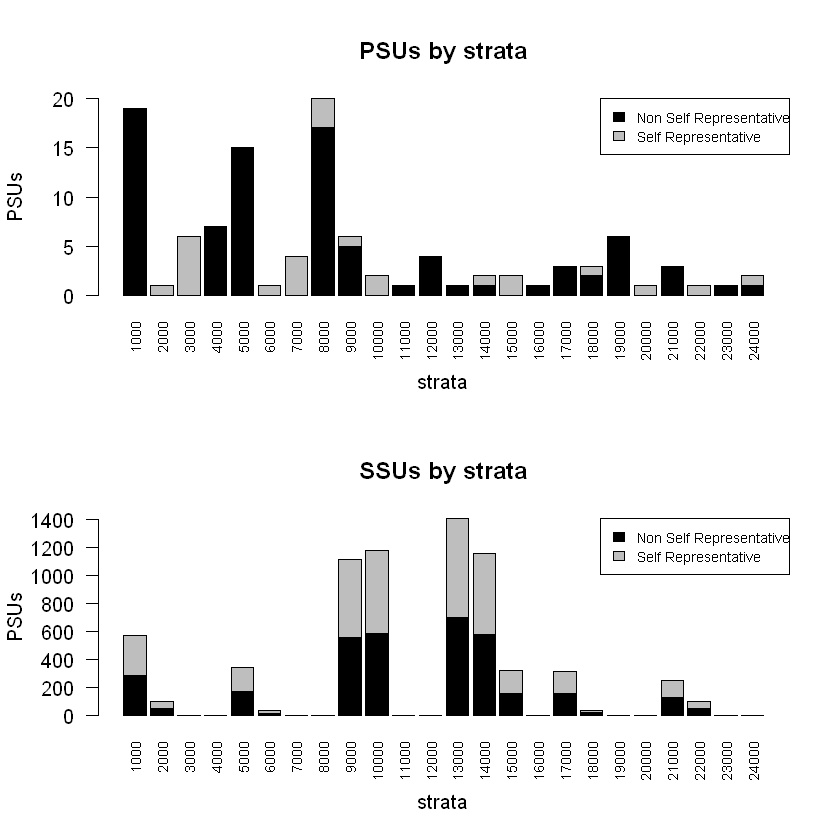
    


```R
sample_1st$PSU_stats
```


<table class="dataframe">
<caption>A data.frame: 25 × 7</caption>
<thead>
	<tr><th scope=col>STRATUM</th><th scope=col>PSU</th><th scope=col>PSU_SR</th><th scope=col>PSU_NSR</th><th scope=col>SSU</th><th scope=col>SSU_SR</th><th scope=col>SSU_NSR</th></tr>
	<tr><th scope=col>&lt;chr&gt;</th><th scope=col>&lt;dbl&gt;</th><th scope=col>&lt;dbl&gt;</th><th scope=col>&lt;dbl&gt;</th><th scope=col>&lt;dbl&gt;</th><th scope=col>&lt;dbl&gt;</th><th scope=col>&lt;dbl&gt;</th></tr>
</thead>
<tbody>
	<tr><td>1000 </td><td> 19</td><td> 0</td><td>19</td><td>1121</td><td> 287</td><td>   0</td></tr>
	<tr><td>10000</td><td>  2</td><td> 2</td><td> 0</td><td> 287</td><td> 588</td><td>   0</td></tr>
	<tr><td>11000</td><td>  1</td><td> 0</td><td> 1</td><td>  32</td><td>   0</td><td>1121</td></tr>
	<tr><td>12000</td><td>  4</td><td> 0</td><td> 4</td><td> 178</td><td>   0</td><td> 341</td></tr>
	<tr><td>13000</td><td>  1</td><td> 0</td><td> 1</td><td>  51</td><td> 704</td><td>   0</td></tr>
	<tr><td>14000</td><td>  2</td><td> 1</td><td> 1</td><td>  81</td><td> 577</td><td>   0</td></tr>
	<tr><td>15000</td><td>  2</td><td> 2</td><td> 0</td><td> 172</td><td> 161</td><td>1059</td></tr>
	<tr><td>16000</td><td>  1</td><td> 0</td><td> 1</td><td>  53</td><td>   0</td><td> 808</td></tr>
	<tr><td>17000</td><td>  3</td><td> 0</td><td> 3</td><td> 145</td><td> 156</td><td>   0</td></tr>
	<tr><td>18000</td><td>  3</td><td> 1</td><td> 2</td><td> 133</td><td>  19</td><td> 114</td></tr>
	<tr><td>19000</td><td>  6</td><td> 0</td><td> 6</td><td> 300</td><td>   0</td><td> 300</td></tr>
	<tr><td>2000 </td><td>  1</td><td> 1</td><td> 0</td><td> 558</td><td>  52</td><td> 324</td></tr>
	<tr><td>20000</td><td>  1</td><td> 1</td><td> 0</td><td> 156</td><td>   0</td><td> 145</td></tr>
	<tr><td>21000</td><td>  3</td><td> 0</td><td> 3</td><td> 127</td><td> 126</td><td>   0</td></tr>
	<tr><td>22000</td><td>  1</td><td> 1</td><td> 0</td><td> 126</td><td>  51</td><td>  84</td></tr>
	<tr><td>23000</td><td>  1</td><td> 0</td><td> 1</td><td>  21</td><td>   0</td><td> 127</td></tr>
	<tr><td>24000</td><td>  2</td><td> 1</td><td> 1</td><td> 135</td><td>   0</td><td>  21</td></tr>
	<tr><td>3000 </td><td>  6</td><td> 6</td><td> 0</td><td> 588</td><td>   0</td><td> 178</td></tr>
	<tr><td>4000 </td><td>  7</td><td> 0</td><td> 7</td><td> 341</td><td>   0</td><td>  32</td></tr>
	<tr><td>5000 </td><td> 15</td><td> 0</td><td>15</td><td> 808</td><td> 172</td><td>   0</td></tr>
	<tr><td>6000 </td><td>  1</td><td> 1</td><td> 0</td><td> 704</td><td>  18</td><td>  63</td></tr>
	<tr><td>7000 </td><td>  4</td><td> 4</td><td> 0</td><td> 577</td><td>   0</td><td>  53</td></tr>
	<tr><td>8000 </td><td> 20</td><td> 3</td><td>17</td><td>1220</td><td>   0</td><td>  51</td></tr>
	<tr><td>9000 </td><td>  6</td><td> 1</td><td> 5</td><td> 376</td><td> 558</td><td>   0</td></tr>
	<tr><td>Total</td><td>112</td><td>25</td><td>87</td><td>8290</td><td>3469</td><td>4821</td></tr>
</tbody>
</table>


## Selection of SSUs (II stage)


```R
samp <- select_SSU(df=pop,
                   PSU_code="municipality",
                   SSU_code="id_ind",
                   PSU_sampled=sample_1st$sample_PSU,
                   verbose=TRUE)
```

    
    PSU =  1  *** Selected SSU =  72
    PSU =  2  *** Selected SSU =  558
    PSU =  3  *** Selected SSU =  51
    PSU =  4  *** Selected SSU =  105
    PSU =  5  *** Selected SSU =  54
    PSU =  6  *** Selected SSU =  79
    PSU =  7  *** Selected SSU =  52
    PSU =  8  *** Selected SSU =  68
    PSU =  9  *** Selected SSU =  51
    PSU =  10  *** Selected SSU =  50
    PSU =  11  *** Selected SSU =  57
    PSU =  12  *** Selected SSU =  73
    PSU =  13  *** Selected SSU =  52
    PSU =  14  *** Selected SSU =  87
    PSU =  15  *** Selected SSU =  58
    PSU =  16  *** Selected SSU =  58
    PSU =  17  *** Selected SSU =  54
    PSU =  18  *** Selected SSU =  187
    PSU =  19  *** Selected SSU =  56
    PSU =  20  *** Selected SSU =  58
    PSU =  21  *** Selected SSU =  53
    PSU =  22  *** Selected SSU =  52
    PSU =  23  *** Selected SSU =  15
    PSU =  24  *** Selected SSU =  77
    PSU =  25  *** Selected SSU =  52
    PSU =  26  *** Selected SSU =  61
    PSU =  27  *** Selected SSU =  54
    PSU =  28  *** Selected SSU =  58
    PSU =  29  *** Selected SSU =  56
    PSU =  30  *** Selected SSU =  59
    PSU =  31  *** Selected SSU =  61
    PSU =  32  *** Selected SSU =  65
    PSU =  33  *** Selected SSU =  65
    PSU =  34  *** Selected SSU =  52
    PSU =  35  *** Selected SSU =  54
    PSU =  36  *** Selected SSU =  107
    PSU =  37  *** Selected SSU =  82
    PSU =  38  *** Selected SSU =  54
    PSU =  39  *** Selected SSU =  53
    PSU =  40  *** Selected SSU =  72
    PSU =  41  *** Selected SSU =  56
    PSU =  42  *** Selected SSU =  51
    PSU =  43  *** Selected SSU =  54
    PSU =  44  *** Selected SSU =  52
    PSU =  45  *** Selected SSU =  48
    PSU =  46  *** Selected SSU =  87
    PSU =  47  *** Selected SSU =  62
    PSU =  48  *** Selected SSU =  57
    PSU =  49  *** Selected SSU =  57
    PSU =  50  *** Selected SSU =  52
    PSU =  51  *** Selected SSU =  130
    PSU =  52  *** Selected SSU =  52
    PSU =  53  *** Selected SSU =  103
    PSU =  54  *** Selected SSU =  54
    PSU =  55  *** Selected SSU =  237
    PSU =  56  *** Selected SSU =  57
    PSU =  57  *** Selected SSU =  53
    PSU =  58  *** Selected SSU =  53
    PSU =  59  *** Selected SSU =  66
    PSU =  60  *** Selected SSU =  51
    PSU =  61  *** Selected SSU =  58
    PSU =  62  *** Selected SSU =  704
    PSU =  63  *** Selected SSU =  55
    PSU =  64  *** Selected SSU =  55
    PSU =  65  *** Selected SSU =  51
    PSU =  66  *** Selected SSU =  71
    PSU =  67  *** Selected SSU =  51
    PSU =  68  *** Selected SSU =  59
    PSU =  69  *** Selected SSU =  60
    PSU =  70  *** Selected SSU =  60
    PSU =  71  *** Selected SSU =  63
    PSU =  72  *** Selected SSU =  60
    PSU =  73  *** Selected SSU =  56
    PSU =  74  *** Selected SSU =  64
    PSU =  75  *** Selected SSU =  15
    PSU =  76  *** Selected SSU =  52
    PSU =  77  *** Selected SSU =  74
    PSU =  78  *** Selected SSU =  54
    PSU =  79  *** Selected SSU =  52
    PSU =  80  *** Selected SSU =  54
    PSU =  81  *** Selected SSU =  32
    PSU =  82  *** Selected SSU =  213
    PSU =  83  *** Selected SSU =  91
    PSU =  84  *** Selected SSU =  63
    PSU =  85  *** Selected SSU =  57
    PSU =  86  *** Selected SSU =  52
    PSU =  87  *** Selected SSU =  18
    PSU =  88  *** Selected SSU =  53
    PSU =  89  *** Selected SSU =  51
    PSU =  90  *** Selected SSU =  63
    PSU =  91  *** Selected SSU =  3
    PSU =  92  *** Selected SSU =  169
    PSU =  93  *** Selected SSU =  51
    PSU =  94  *** Selected SSU =  19
    PSU =  95  *** Selected SSU =  29
    PSU =  96  *** Selected SSU =  41
    PSU =  97  *** Selected SSU =  55
    PSU =  98  *** Selected SSU =  63
    PSU =  99  *** Selected SSU =  51
    PSU =  100  *** Selected SSU =  55
    PSU =  101  *** Selected SSU =  53
    PSU =  102  *** Selected SSU =  53
    PSU =  103  *** Selected SSU =  54
    PSU =  104  *** Selected SSU =  156
    PSU =  105  *** Selected SSU =  54
    PSU =  106  *** Selected SSU =  84
    PSU =  107  *** Selected SSU =  21
    PSU =  108  *** Selected SSU =  126
    PSU =  109  *** Selected SSU =  53
    PSU =  110  *** Selected SSU =  51
    PSU =  111  *** Selected SSU =  23
    PSU =  112  *** Selected SSU =  51
    --------------------------------
    Total PSU =  112
    Total SSU =  8290
    --------------------------------


```R
nrow(samp)
sum(alloc$alloc$ALLOC[-nrow(alloc$alloc)])
```


8290


8296


```R
nrow(pop)
sum(samp$weight)
```


2258507


2258507


```R
## Plot of weights distribution
par(mfrow=c(1, 2))
boxplot(samp$weight,col="grey")
title("Weights distribution (total sample)",cex.main=0.7)
boxplot(weight ~ region, data=samp,col="grey")
title("Weights distribution by region",cex.main=0.7)
par(mfrow=c(1, 2))
boxplot(weight ~ province, data=samp,col="grey")
title("Weights distribution by province",cex.main=0.7)
boxplot(weight ~ stratum, data=samp,col="grey")
title("Weights distribution by stratum",cex.main=0.7)
```


    
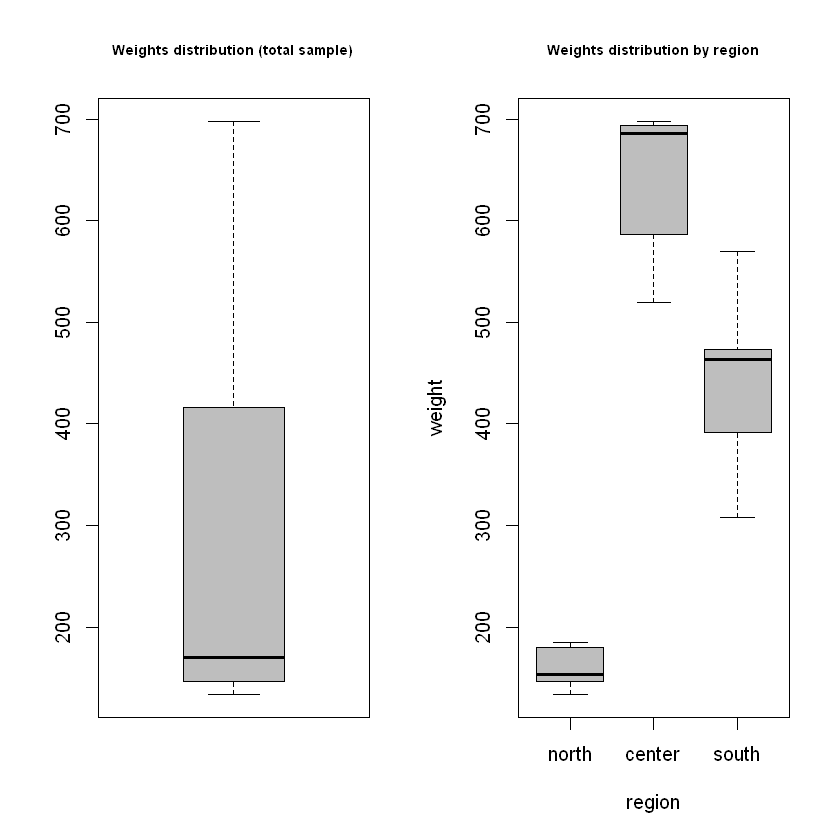
    


    
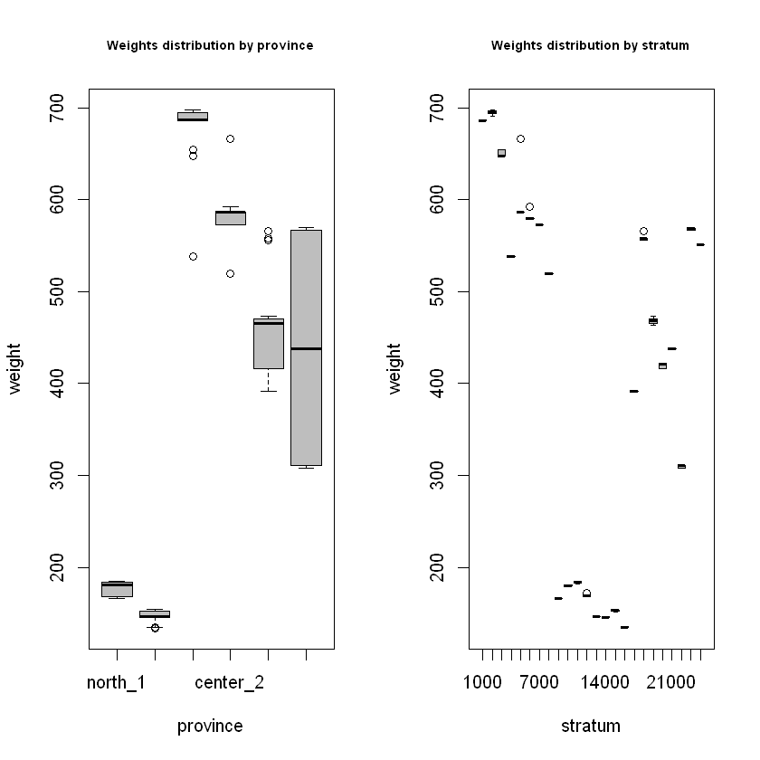
    


## Precision constraints compliance control (by simulation)


```R
df=pop
df$one <- 1
PSU_code="municipality"
SSU_code="id_ind"
target_vars <- c("income_hh",
                 "active",
                 "inactive",
                 "unemployed")  
```


```R
# Domain level = national
domain_var <- "one"
set.seed(1234)
eval <- eval_2stage(df,
                    PSU_code,
                    SSU_code,
                    domain_var,
                    target_vars,
                    sample_1st$sample_PSU,
                    nsampl=100, 
                    writeFiles=FALSE,
                    progress=TRUE) 
eval$coeff_var
```

      |======================================================================| 100%
    


<table class="dataframe">
<caption>A data.frame: 1 × 5</caption>
<thead>
	<tr><th scope=col>CV1</th><th scope=col>CV2</th><th scope=col>CV3</th><th scope=col>CV4</th><th scope=col>dom</th></tr>
	<tr><th scope=col>&lt;dbl&gt;</th><th scope=col>&lt;dbl&gt;</th><th scope=col>&lt;dbl&gt;</th><th scope=col>&lt;dbl&gt;</th><th scope=col>&lt;chr&gt;</th></tr>
</thead>
<tbody>
	<tr><td>0.0104</td><td>0.0096</td><td>0.0254</td><td>0.0337</td><td>DOM1</td></tr>
</tbody>
</table>


```R
# Domain level = regional
domain_var <- "region"
set.seed(1234)
set.seed(1234)
eval <- eval_2stage(df,
                    PSU_code,
                    SSU_code,
                    domain_var,
                    target_vars,
                    sample_1st$sample_PSU,
                    nsampl=100, 
                    writeFiles=FALSE,
                    progress=TRUE) 
eval$coeff_var
```

      |======================================================================| 100%
    


    
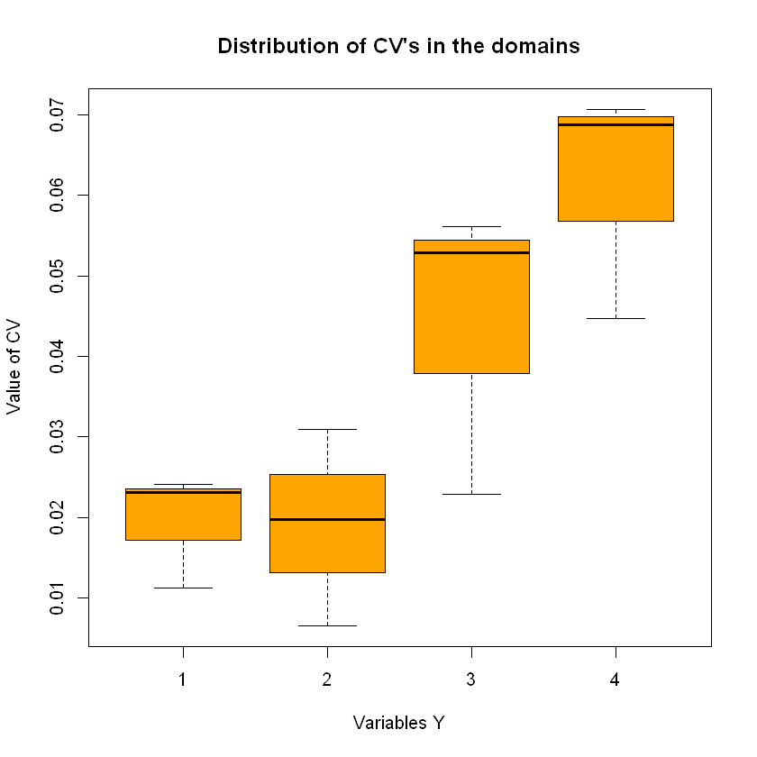
    


<table class="dataframe">
<caption>A data.frame: 3 × 5</caption>
<thead>
	<tr><th scope=col>CV1</th><th scope=col>CV2</th><th scope=col>CV3</th><th scope=col>CV4</th><th scope=col>dom</th></tr>
	<tr><th scope=col>&lt;dbl&gt;</th><th scope=col>&lt;dbl&gt;</th><th scope=col>&lt;dbl&gt;</th><th scope=col>&lt;dbl&gt;</th><th scope=col>&lt;chr&gt;</th></tr>
</thead>
<tbody>
	<tr><td>0.0113</td><td>0.0065</td><td>0.0229</td><td>0.0688</td><td>DOM1</td></tr>
	<tr><td>0.0241</td><td>0.0197</td><td>0.0529</td><td>0.0707</td><td>DOM2</td></tr>
	<tr><td>0.0231</td><td>0.0309</td><td>0.0561</td><td>0.0447</td><td>DOM3</td></tr>
</tbody>
</table>


    
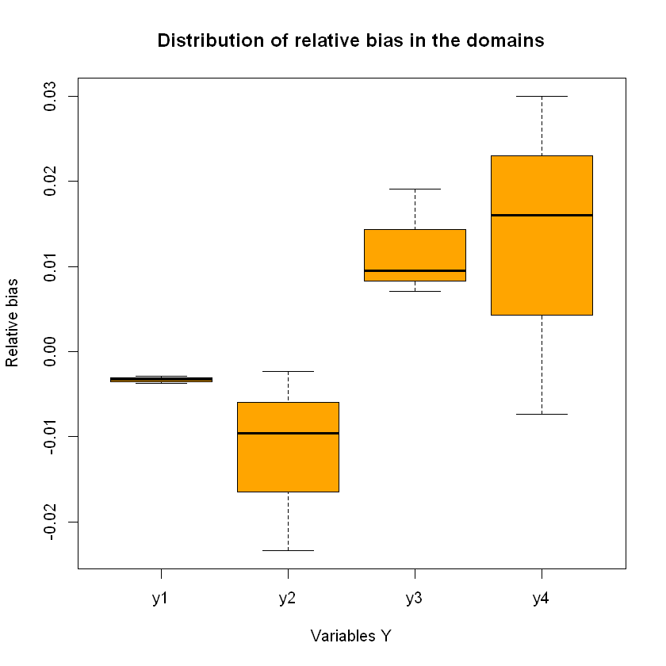
    


```R
alloc$sensitivity
```


<table class="dataframe">
<caption>A data.frame: 4 × 6</caption>
<thead>
	<tr><th></th><th scope=col>Type</th><th scope=col>Dom</th><th scope=col>V1</th><th scope=col>V2</th><th scope=col>V3</th><th scope=col>V4</th></tr>
	<tr><th></th><th scope=col>&lt;chr&gt;</th><th scope=col>&lt;chr&gt;</th><th scope=col>&lt;dbl&gt;</th><th scope=col>&lt;dbl&gt;</th><th scope=col>&lt;dbl&gt;</th><th scope=col>&lt;dbl&gt;</th></tr>
</thead>
<tbody>
	<tr><th scope=row>2</th><td>DOM1</td><td>1</td><td>  1</td><td>0</td><td> 1</td><td>   1</td></tr>
	<tr><th scope=row>6</th><td>DOM2</td><td>1</td><td>  1</td><td>0</td><td> 1</td><td>1184</td></tr>
	<tr><th scope=row>10</th><td>DOM2</td><td>2</td><td>  1</td><td>0</td><td> 1</td><td> 246</td></tr>
	<tr><th scope=row>14</th><td>DOM2</td><td>3</td><td>192</td><td>1</td><td>37</td><td>   1</td></tr>
</tbody>
</table>


```R
save(samp,file="sample.RData")
```

# Scenario 2
One previous round of the sampling survey is available.

## Analysis of sampled data


```R
library(ReGenesees)
```

    
    
    
    
    --------------------------------------------------------
    
    > The ReGenesees package has been successfully loaded. <
    
    --------------------------------------------------------
    
    
    
    
    
    

    Package: ReGenesees
    Type: Package
    Title: R Evolved Generalized Software for Sampling Estimates and Errors
            in Surveys
    Description: Design-Based and Model-Assisted analysis of complex
            sampling surveys. Multistage, stratified, clustered, unequally
            weighted survey designs. Horvitz-Thompson and Calibration
            Estimators. Variance Estimation for nonlinear smooth estimators
            by Taylor-series linearization. Estimates, standard errors,
            confidence intervals and design effects for: Totals, Means,
            absolute and relative Frequency Distributions (marginal,
            conditional and joint), Ratios, Shares and Ratios of Shares,
            Multiple Regression Coefficients and Quantiles. Automated
            Linearization of Complex Analytic Estimators. Design Covariance
            and Correlation. Estimates, standard errors, confidence
            intervals and design effects for user-defined analytic
            estimators. Estimates and sampling errors for subpopulations.
            Consistent trimming of calibration weights. Calibration on
            complex population parameters, e.g. multiple regression
            coefficients. Generalized Variance Functions (GVF) method for
            predicting variance estimates.
    Version: 2.1
    Author: Diego Zardetto [aut, cre]
    Maintainer: Diego Zardetto <zardetto@istat.it>
    Authors@R: person("Diego", "Zardetto", role = c("aut", "cre"), email =
            "zardetto@istat.it")
    License: EUPL
    URL: https://diegozardetto.github.io/ReGenesees/,
            https://github.com/DiegoZardetto/ReGenesees/
    BugReports: https://github.com/DiegoZardetto/ReGenesees/issues/
    Imports: stats, MASS
    Depends: R (>= 2.14.0)
    ByteCompile: TRUE
    RemoteType: github
    RemoteHost: api.github.com
    RemoteRepo: ReGenesees
    RemoteUsername: DiegoZardetto
    RemoteRef: HEAD
    RemoteSha: c0bd789ed6ab88a4b3a02bd553f51d8f4ec857e2
    GithubRepo: ReGenesees
    GithubUsername: DiegoZardetto
    GithubRef: HEAD
    GithubSHA1: c0bd789ed6ab88a4b3a02bd553f51d8f4ec857e2
    NeedsCompilation: no
    Packaged: 2021-09-28 11:33:29 UTC; Giulio
    Built: R 4.1.1; ; 2021-09-28 11:33:35 UTC; windows
    

    
    
    


```R
load("sample.RData")
str(samp)
```

    'data.frame':	8290 obs. of  20 variables:
     $ municipality : Factor w/ 112 levels "4","8","9","11",..: 31 31 31 31 31 31 31 31 31 31 ...
     $ id_ind       : int  14478 14681 14888 14914 15034 15047 15147 15169 15173 15224 ...
     $ region       : Factor w/ 3 levels "north","center",..: 1 1 1 1 1 1 1 1 1 1 ...
     $ province     : Factor w/ 6 levels "north_1","north_2",..: 1 1 1 1 1 1 1 1 1 1 ...
     $ id_hh        : Factor w/ 963018 levels "H1","H10","H100",..: 96659 96724 96795 96802 96838 96844 96879 96888 96889 96910 ...
     $ stratum      : Factor w/ 24 levels "1000","2000",..: 11 11 11 11 11 11 11 11 11 11 ...
     $ stratum_label: chr  "north_1_5" "north_1_5" "north_1_5" "north_1_5" ...
     $ sex          : int  1 1 2 2 2 1 1 2 1 1 ...
     $ cl_age       : Factor w/ 8 levels "(0,14]","(14,24]",..: 1 5 1 4 4 2 4 2 4 4 ...
     $ active       : num  0 1 0 1 1 1 1 1 1 1 ...
     $ income_hh    : num  22289 28918 19792 25656 28864 ...
     $ unemployed   : num  0 0 0 0 0 0 0 0 0 0 ...
     $ inactive     : num  1 0 1 0 0 0 0 0 0 0 ...
     $ Prob_1st     : num  0.484 0.484 0.484 0.484 0.484 ...
     $ Prob_2st     : num  0.0112 0.0112 0.0112 0.0112 0.0112 ...
     $ Prob_tot     : num  0.00543 0.00543 0.00543 0.00543 0.00543 ...
     $ weight       : num  184 184 184 184 184 ...
     $ SR           : num  0 0 0 0 0 0 0 0 0 0 ...
     $ nSR          : num  1 1 1 1 1 1 1 1 1 1 ...
     $ stratum_2    : chr  "110003" "110003" "110003" "110003" ...
    


```R
## Sample design description
samp$stratum_2 <- as.factor(samp$stratum_2)
sample.des <- e.svydesign(samp, 
                          ids= ~ municipality + id_hh, 
                          strata = ~ stratum_2, 
                          weights = ~ weight,
                          self.rep.str = ~ SR,
                          check.data = TRUE)
```

    
    # Empty levels found in factors: id_hh
    # Empty levels have been dropped!
    
    

    Warning message in e.svydesign(samp, ids = ~municipality + id_hh, strata = ~stratum_2, :
    "Sampling variance estimation for this design will take into account only leading contributions, i.e. PSUs in not-SR strata and SSUs in SR strata (see ?e.svydesign and ?ReGenesees.options for details)"
    


```R
## Find and collapse lonely strata
ls <- find.lon.strata(sample.des)
sample.des <- collapse.strata(sample.des)
```

    
    # All lonely strata (87) successfully collapsed!
    
    

    Warning message in collapse.strata(sample.des):
    "No similarity score specified: achieved strata aggregation depends on the ordering of sample data"
    


```R
## Calibration with known totals
totals <- pop.template(sample.des,
             calmodel = ~ sex : cl_age, 
             partition = ~ region)
totals <- fill.template(pop, totals, mem.frac = 10)
sample.cal <- e.calibrate(sample.des, 
                          totals,
                          calmodel = ~ sex : cl_age, 
                          partition = ~ region,
                          calfun = "logit",
                          bounds = c(0.3, 2.6), 
                          aggregate.stage = 2,
                          force = FALSE)
```

    
    # Coherence check between 'universe' and 'template': OK
    
    

## Preparation of inputs for allocation steps


```R
samp_frame <- pop
RGdes <- sample.des
RGcal <- sample.cal
strata_vars <- c("stratum")      
target_vars <- c("income_hh",
                 "active",
                 "inactive",
                 "unemployed")   
weight_var <- "weight"
deff_vars <- "stratum"            
id_PSU <- c("municipality")      
id_SSU <- c("id_hh")             
domain_vars <- c("region") 
delta <- 1                   
minimum <- 50                

inp <- prepareInputToAllocation2(
        samp_frame,  # sampling frame
        RGdes,       # ReGenesees design object
        RGcal,       # ReGenesees calibrated object
        id_PSU,      # identification variable of PSUs
        id_SSU,      # identification variable of SSUs
        strata_vars, # strata variables
        target_vars, # target variables
        deff_vars,   # deff variables
        domain_vars, # domain variables
        delta,       # Average number of SSUs for each selection unit
        minimum      # Minimum number of SSUs to be selected in each PSU
      )
```


```R
head(inp$strata)
```


<table class="dataframe">
<caption>A data.frame: 6 × 15</caption>
<thead>
	<tr><th></th><th scope=col>stratum</th><th scope=col>STRATUM</th><th scope=col>N</th><th scope=col>M1</th><th scope=col>M2</th><th scope=col>M3</th><th scope=col>M4</th><th scope=col>S1</th><th scope=col>S2</th><th scope=col>S3</th><th scope=col>S4</th><th scope=col>COST</th><th scope=col>CENS</th><th scope=col>DOM1</th><th scope=col>DOM2</th></tr>
	<tr><th></th><th scope=col>&lt;fct&gt;</th><th scope=col>&lt;chr&gt;</th><th scope=col>&lt;dbl&gt;</th><th scope=col>&lt;dbl&gt;</th><th scope=col>&lt;dbl&gt;</th><th scope=col>&lt;dbl&gt;</th><th scope=col>&lt;dbl&gt;</th><th scope=col>&lt;dbl&gt;</th><th scope=col>&lt;dbl&gt;</th><th scope=col>&lt;dbl&gt;</th><th scope=col>&lt;dbl&gt;</th><th scope=col>&lt;dbl&gt;</th><th scope=col>&lt;dbl&gt;</th><th scope=col>&lt;dbl&gt;</th><th scope=col>&lt;fct&gt;</th></tr>
</thead>
<tbody>
	<tr><th scope=row>1</th><td>1000 </td><td>1000 </td><td>196095</td><td>25283.04</td><td>0.6908830</td><td>0.2436486</td><td>0.06546845</td><td>23223.11</td><td>0.4621295</td><td>0.4292831</td><td>0.2473506</td><td>1</td><td>0</td><td>1</td><td>center</td></tr>
	<tr><th scope=row>2</th><td>10000</td><td>10000</td><td>106119</td><td>28972.56</td><td>0.7762824</td><td>0.2033010</td><td>0.02041662</td><td>21596.37</td><td>0.4167350</td><td>0.4024546</td><td>0.1414206</td><td>1</td><td>0</td><td>1</td><td>north </td></tr>
	<tr><th scope=row>3</th><td>11000</td><td>11000</td><td>205701</td><td>28591.64</td><td>0.7829250</td><td>0.1983132</td><td>0.01876181</td><td>35059.27</td><td>0.4122541</td><td>0.3987293</td><td>0.1356827</td><td>1</td><td>0</td><td>1</td><td>north </td></tr>
	<tr><th scope=row>4</th><td>12000</td><td>12000</td><td> 57396</td><td>25963.68</td><td>0.7575331</td><td>0.2277654</td><td>0.01470142</td><td>15511.53</td><td>0.4285752</td><td>0.4193904</td><td>0.1203549</td><td>1</td><td>0</td><td>1</td><td>north </td></tr>
	<tr><th scope=row>5</th><td>13000</td><td>13000</td><td>103266</td><td>27476.83</td><td>0.7837272</td><td>0.1775604</td><td>0.03871240</td><td>22898.40</td><td>0.4117024</td><td>0.3821423</td><td>0.1929086</td><td>1</td><td>0</td><td>1</td><td>north </td></tr>
	<tr><th scope=row>6</th><td>14000</td><td>14000</td><td> 83998</td><td>24287.14</td><td>0.7602083</td><td>0.2065345</td><td>0.03325712</td><td>17173.44</td><td>0.4269562</td><td>0.4048185</td><td>0.1793072</td><td>1</td><td>0</td><td>1</td><td>north </td></tr>
</tbody>
</table>


```R
head(inp$deff)
```


<table class="dataframe">
<caption>A data.frame: 6 × 7</caption>
<thead>
	<tr><th></th><th scope=col>stratum</th><th scope=col>STRATUM</th><th scope=col>DEFF1</th><th scope=col>DEFF2</th><th scope=col>DEFF3</th><th scope=col>DEFF4</th><th scope=col>b_nar</th></tr>
	<tr><th></th><th scope=col>&lt;fct&gt;</th><th scope=col>&lt;chr&gt;</th><th scope=col>&lt;dbl&gt;</th><th scope=col>&lt;dbl&gt;</th><th scope=col>&lt;dbl&gt;</th><th scope=col>&lt;dbl&gt;</th><th scope=col>&lt;dbl&gt;</th></tr>
</thead>
<tbody>
	<tr><th scope=row>1</th><td>1000 </td><td>1000 </td><td>0.999876</td><td>0.999528</td><td>1.000412</td><td>1.004149</td><td>143.50000</td></tr>
	<tr><th scope=row>2</th><td>10000</td><td>10000</td><td>1.027703</td><td>1.001044</td><td>0.988835</td><td>1.174327</td><td> 98.00000</td></tr>
	<tr><th scope=row>3</th><td>11000</td><td>11000</td><td>0.592872</td><td>0.457294</td><td>0.681566</td><td>1.838375</td><td> 59.00000</td></tr>
	<tr><th scope=row>4</th><td>12000</td><td>12000</td><td>3.071332</td><td>0.887471</td><td>0.856744</td><td>0.856610</td><td> 48.71429</td></tr>
	<tr><th scope=row>5</th><td>13000</td><td>13000</td><td>1.018096</td><td>1.022899</td><td>1.015849</td><td>1.001630</td><td>704.00000</td></tr>
	<tr><th scope=row>6</th><td>14000</td><td>14000</td><td>1.014614</td><td>1.002947</td><td>1.002986</td><td>1.011830</td><td>144.25000</td></tr>
</tbody>
</table>


```R
head(inp$effst)
```


<table class="dataframe">
<caption>A data.frame: 6 × 6</caption>
<thead>
	<tr><th></th><th scope=col>stratum</th><th scope=col>STRATUM</th><th scope=col>EFFST1</th><th scope=col>EFFST2</th><th scope=col>EFFST3</th><th scope=col>EFFST4</th></tr>
	<tr><th></th><th scope=col>&lt;fct&gt;</th><th scope=col>&lt;chr&gt;</th><th scope=col>&lt;dbl&gt;</th><th scope=col>&lt;dbl&gt;</th><th scope=col>&lt;dbl&gt;</th><th scope=col>&lt;dbl&gt;</th></tr>
</thead>
<tbody>
	<tr><th scope=row>1</th><td>1000 </td><td>1000 </td><td>0.9486306</td><td>0.7988180</td><td>0.7076215</td><td>1.0322402</td></tr>
	<tr><th scope=row>2</th><td>10000</td><td>10000</td><td>0.9960368</td><td>0.8951515</td><td>0.8772252</td><td>0.9968016</td></tr>
	<tr><th scope=row>3</th><td>11000</td><td>11000</td><td>1.0379964</td><td>0.9650269</td><td>0.8209022</td><td>1.0018701</td></tr>
	<tr><th scope=row>4</th><td>12000</td><td>12000</td><td>0.9549886</td><td>0.8942016</td><td>0.8794657</td><td>1.0037357</td></tr>
	<tr><th scope=row>5</th><td>13000</td><td>13000</td><td>0.9973725</td><td>0.9187114</td><td>0.8945896</td><td>1.0074768</td></tr>
	<tr><th scope=row>6</th><td>14000</td><td>14000</td><td>0.9979007</td><td>0.9206678</td><td>0.9005948</td><td>1.0090391</td></tr>
</tbody>
</table>


```R
head(inp$rho)
```


<table class="dataframe">
<caption>A data.frame: 6 × 9</caption>
<thead>
	<tr><th></th><th scope=col>STRATUM</th><th scope=col>RHO_AR1</th><th scope=col>RHO_NAR1</th><th scope=col>RHO_AR2</th><th scope=col>RHO_NAR2</th><th scope=col>RHO_AR3</th><th scope=col>RHO_NAR3</th><th scope=col>RHO_AR4</th><th scope=col>RHO_NAR4</th></tr>
	<tr><th></th><th scope=col>&lt;chr&gt;</th><th scope=col>&lt;dbl&gt;</th><th scope=col>&lt;dbl&gt;</th><th scope=col>&lt;dbl&gt;</th><th scope=col>&lt;dbl&gt;</th><th scope=col>&lt;dbl&gt;</th><th scope=col>&lt;dbl&gt;</th><th scope=col>&lt;dbl&gt;</th><th scope=col>&lt;dbl&gt;</th></tr>
</thead>
<tbody>
	<tr><th scope=row>1</th><td>1000 </td><td>1</td><td>-0.0000008701754</td><td>1</td><td>-0.000003312281</td><td>1</td><td> 0.000002891228</td><td>1</td><td> 0.000029115789</td></tr>
	<tr><th scope=row>2</th><td>10000</td><td>1</td><td> 0.0002855979381</td><td>1</td><td> 0.000010762887</td><td>1</td><td>-0.000115103093</td><td>1</td><td> 0.001797185567</td></tr>
	<tr><th scope=row>3</th><td>11000</td><td>1</td><td>-0.0070194482759</td><td>1</td><td>-0.009357000000</td><td>1</td><td>-0.005490241379</td><td>1</td><td> 0.014454741379</td></tr>
	<tr><th scope=row>4</th><td>12000</td><td>1</td><td> 0.0434111497006</td><td>1</td><td>-0.002358392216</td><td>1</td><td>-0.003002371257</td><td>1</td><td>-0.003005179641</td></tr>
	<tr><th scope=row>5</th><td>13000</td><td>1</td><td> 0.0000257411095</td><td>1</td><td> 0.000032573257</td><td>1</td><td> 0.000022544808</td><td>1</td><td> 0.000002318634</td></tr>
	<tr><th scope=row>6</th><td>14000</td><td>1</td><td> 0.0001020174520</td><td>1</td><td> 0.000020572426</td><td>1</td><td> 0.000020844677</td><td>1</td><td> 0.000082582897</td></tr>
</tbody>
</table>


```R
head(inp$psu_file)
```


<table class="dataframe">
<caption>A data.frame: 6 × 3</caption>
<thead>
	<tr><th></th><th scope=col>PSU_ID</th><th scope=col>STRATUM</th><th scope=col>PSU_MOS</th></tr>
	<tr><th></th><th scope=col>&lt;dbl&gt;</th><th scope=col>&lt;fct&gt;</th><th scope=col>&lt;dbl&gt;</th></tr>
</thead>
<tbody>
	<tr><th scope=row>1</th><td>309</td><td>1000</td><td> 50845</td></tr>
	<tr><th scope=row>2</th><td>330</td><td>1000</td><td>146162</td></tr>
	<tr><th scope=row>3</th><td>292</td><td>2000</td><td> 24794</td></tr>
	<tr><th scope=row>4</th><td>293</td><td>2000</td><td> 19609</td></tr>
	<tr><th scope=row>5</th><td>300</td><td>2000</td><td> 13897</td></tr>
	<tr><th scope=row>6</th><td>304</td><td>2000</td><td> 36195</td></tr>
</tbody>
</table>


```R
head(inp$des_file)
```


<table class="dataframe">
<caption>A data.frame: 6 × 4</caption>
<thead>
	<tr><th></th><th scope=col>STRATUM</th><th scope=col>STRAT_MOS</th><th scope=col>DELTA</th><th scope=col>MINIMUM</th></tr>
	<tr><th></th><th scope=col>&lt;fct&gt;</th><th scope=col>&lt;dbl&gt;</th><th scope=col>&lt;dbl&gt;</th><th scope=col>&lt;dbl&gt;</th></tr>
</thead>
<tbody>
	<tr><th scope=row>1</th><td>1000</td><td>197007</td><td>1</td><td>50</td></tr>
	<tr><th scope=row>2</th><td>2000</td><td>261456</td><td>1</td><td>50</td></tr>
	<tr><th scope=row>3</th><td>3000</td><td>115813</td><td>1</td><td>50</td></tr>
	<tr><th scope=row>4</th><td>4000</td><td> 17241</td><td>1</td><td>50</td></tr>
	<tr><th scope=row>5</th><td>5000</td><td>101067</td><td>1</td><td>50</td></tr>
	<tr><th scope=row>6</th><td>6000</td><td> 47218</td><td>1</td><td>50</td></tr>
</tbody>
</table>


## Allocation


```R
set.seed(1234)
minPSUstrat <- 2
inp$des_file$MINIMUM <- 50
alloc <- beat.2st(stratif = inp$strata, 
                  errors = cv, 
                  des_file = inp$des_file, 
                  psu_file = inp$psu_file, 
                  rho = inp$rho, 
                  deft_start = NULL, 
                  effst = inp$effst,
                  epsilon1 = 5, 
                  mmdiff_deft = 1,
                  maxi = 15, 
                  epsilon = 10^(-11), 
                  minnumstrat = 2, 
                  minPSUstrat,
                  maxiter = 200, 
                  maxiter1 = 25)
```

      iterations PSU_SR PSU NSR PSU Total  SSU
    1          0      0       0         0 7402
    2          1     44      72       116 9745
    3          2     37     110       147 8717
    4          3     30     106       136 9066
    5          4     31     110       141 9026
    

## Selection of PSUs (I stage)


```R
set.seed(1234)
sample_1st <- select_PSU(alloc, type="ALLOC", pps=TRUE)
```


    
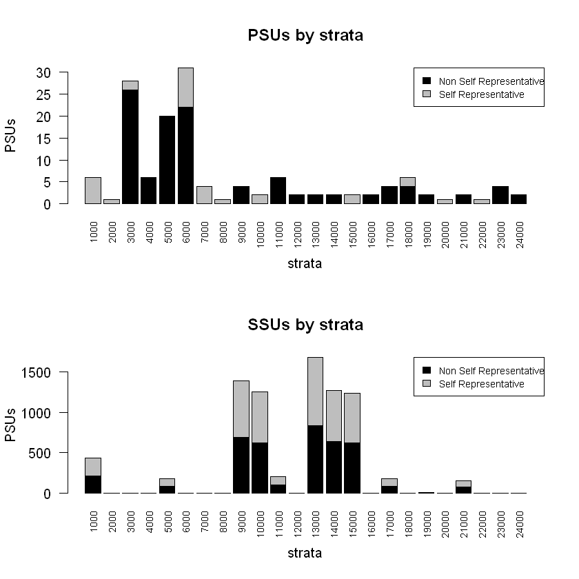
    


```R
sample_1st$PSU_stats
```


<table class="dataframe">
<caption>A data.frame: 25 × 7</caption>
<thead>
	<tr><th scope=col>STRATUM</th><th scope=col>PSU</th><th scope=col>PSU_SR</th><th scope=col>PSU_NSR</th><th scope=col>SSU</th><th scope=col>SSU_SR</th><th scope=col>SSU_NSR</th></tr>
	<tr><th scope=col>&lt;chr&gt;</th><th scope=col>&lt;dbl&gt;</th><th scope=col>&lt;dbl&gt;</th><th scope=col>&lt;dbl&gt;</th><th scope=col>&lt;dbl&gt;</th><th scope=col>&lt;dbl&gt;</th><th scope=col>&lt;dbl&gt;</th></tr>
</thead>
<tbody>
	<tr><td>1000 </td><td>  6</td><td> 6</td><td>  0</td><td> 626</td><td> 218</td><td>   0</td></tr>
	<tr><td>10000</td><td>  2</td><td> 2</td><td>  0</td><td> 218</td><td> 626</td><td>   0</td></tr>
	<tr><td>11000</td><td>  6</td><td> 0</td><td>  6</td><td> 270</td><td> 102</td><td>1396</td></tr>
	<tr><td>12000</td><td>  2</td><td> 0</td><td>  2</td><td>   2</td><td>   0</td><td> 268</td></tr>
	<tr><td>13000</td><td>  2</td><td> 0</td><td>  2</td><td>   2</td><td> 839</td><td>   0</td></tr>
	<tr><td>14000</td><td>  2</td><td> 0</td><td>  2</td><td>   2</td><td> 635</td><td>   0</td></tr>
	<tr><td>15000</td><td>  2</td><td> 2</td><td>  0</td><td>  88</td><td> 619</td><td>1254</td></tr>
	<tr><td>16000</td><td>  2</td><td> 0</td><td>  2</td><td>  28</td><td>   0</td><td>1038</td></tr>
	<tr><td>17000</td><td>  4</td><td> 0</td><td>  4</td><td> 124</td><td>  88</td><td>   0</td></tr>
	<tr><td>18000</td><td>  6</td><td> 2</td><td>  4</td><td> 216</td><td>   0</td><td>  44</td></tr>
	<tr><td>19000</td><td>  2</td><td> 0</td><td>  2</td><td>  44</td><td>   6</td><td> 210</td></tr>
	<tr><td>2000 </td><td>  1</td><td> 1</td><td>  0</td><td> 693</td><td>   0</td><td> 270</td></tr>
	<tr><td>20000</td><td>  1</td><td> 1</td><td>  0</td><td>  88</td><td>   0</td><td> 124</td></tr>
	<tr><td>21000</td><td>  2</td><td> 0</td><td>  2</td><td>   2</td><td>  79</td><td>   0</td></tr>
	<tr><td>22000</td><td>  1</td><td> 1</td><td>  0</td><td>  79</td><td>   0</td><td>  56</td></tr>
	<tr><td>23000</td><td>  4</td><td> 0</td><td>  4</td><td> 188</td><td>   0</td><td> 188</td></tr>
	<tr><td>24000</td><td>  2</td><td> 0</td><td>  2</td><td>  56</td><td>   0</td><td>   2</td></tr>
	<tr><td>3000 </td><td> 28</td><td> 2</td><td> 26</td><td>1498</td><td>   0</td><td> 134</td></tr>
	<tr><td>4000 </td><td>  6</td><td> 0</td><td>  6</td><td> 268</td><td>   0</td><td>   2</td></tr>
	<tr><td>5000 </td><td> 20</td><td> 0</td><td> 20</td><td>1038</td><td>  88</td><td>   0</td></tr>
	<tr><td>6000 </td><td> 31</td><td> 9</td><td> 22</td><td>1873</td><td>   0</td><td>  28</td></tr>
	<tr><td>7000 </td><td>  4</td><td> 4</td><td>  0</td><td> 635</td><td>   0</td><td>   2</td></tr>
	<tr><td>8000 </td><td>  1</td><td> 1</td><td>  0</td><td> 839</td><td>   0</td><td>   2</td></tr>
	<tr><td>9000 </td><td>  4</td><td> 0</td><td>  4</td><td> 134</td><td> 693</td><td>   0</td></tr>
	<tr><td>Total</td><td>141</td><td>31</td><td>110</td><td>9011</td><td>3993</td><td>5018</td></tr>
</tbody>
</table>


## Selection of SSUs (II stage)


```R
set.seed(1234)
samp <- select_SSU(df=pop,
                   PSU_code="municipality",
                   SSU_code="id_ind",
                   PSU_sampled=sample_1st$sample_PSU,
                   verbose=TRUE)
```

    
    PSU =  1  *** Selected SSU =  77
    PSU =  2  *** Selected SSU =  58
    PSU =  3  *** Selected SSU =  693
    PSU =  4  *** Selected SSU =  112
    PSU =  5  *** Selected SSU =  84
    PSU =  6  *** Selected SSU =  51
    PSU =  7  *** Selected SSU =  52
    PSU =  8  *** Selected SSU =  66
    PSU =  9  *** Selected SSU =  52
    PSU =  10  *** Selected SSU =  30
    PSU =  11  *** Selected SSU =  56
    PSU =  12  *** Selected SSU =  56
    PSU =  13  *** Selected SSU =  52
    PSU =  14  *** Selected SSU =  50
    PSU =  15  *** Selected SSU =  92
    PSU =  16  *** Selected SSU =  62
    PSU =  17  *** Selected SSU =  50
    PSU =  18  *** Selected SSU =  199
    PSU =  19  *** Selected SSU =  51
    PSU =  20  *** Selected SSU =  59
    PSU =  21  *** Selected SSU =  51
    PSU =  22  *** Selected SSU =  52
    PSU =  23  *** Selected SSU =  58
    PSU =  24  *** Selected SSU =  51
    PSU =  25  *** Selected SSU =  52
    PSU =  26  *** Selected SSU =  58
    PSU =  27  *** Selected SSU =  52
    PSU =  28  *** Selected SSU =  52
    PSU =  29  *** Selected SSU =  52
    PSU =  30  *** Selected SSU =  58
    PSU =  31  *** Selected SSU =  56
    PSU =  32  *** Selected SSU =  30
    PSU =  33  *** Selected SSU =  52
    PSU =  34  *** Selected SSU =  30
    PSU =  35  *** Selected SSU =  58
    PSU =  36  *** Selected SSU =  52
    PSU =  37  *** Selected SSU =  56
    PSU =  38  *** Selected SSU =  58
    PSU =  39  *** Selected SSU =  30
    PSU =  40  *** Selected SSU =  59
    PSU =  41  *** Selected SSU =  66
    PSU =  42  *** Selected SSU =  81
    PSU =  43  *** Selected SSU =  52
    PSU =  44  *** Selected SSU =  118
    PSU =  45  *** Selected SSU =  54
    PSU =  46  *** Selected SSU =  58
    PSU =  47  *** Selected SSU =  63
    PSU =  48  *** Selected SSU =  52
    PSU =  49  *** Selected SSU =  52
    PSU =  50  *** Selected SSU =  52
    PSU =  51  *** Selected SSU =  54
    PSU =  52  *** Selected SSU =  56
    PSU =  53  *** Selected SSU =  54
    PSU =  54  *** Selected SSU =  47
    PSU =  55  *** Selected SSU =  56
    PSU =  56  *** Selected SSU =  62
    PSU =  57  *** Selected SSU =  52
    PSU =  58  *** Selected SSU =  52
    PSU =  59  *** Selected SSU =  64
    PSU =  60  *** Selected SSU =  31
    PSU =  61  *** Selected SSU =  80
    PSU =  62  *** Selected SSU =  71
    PSU =  63  *** Selected SSU =  64
    PSU =  64  *** Selected SSU =  58
    PSU =  65  *** Selected SSU =  51
    PSU =  66  *** Selected SSU =  88
    PSU =  67  *** Selected SSU =  52
    PSU =  68  *** Selected SSU =  54
    PSU =  69  *** Selected SSU =  52
    PSU =  70  *** Selected SSU =  52
    PSU =  71  *** Selected SSU =  143
    PSU =  72  *** Selected SSU =  58
    PSU =  73  *** Selected SSU =  51
    PSU =  74  *** Selected SSU =  114
    PSU =  75  *** Selected SSU =  52
    PSU =  76  *** Selected SSU =  260
    PSU =  77  *** Selected SSU =  54
    PSU =  78  *** Selected SSU =  50
    PSU =  79  *** Selected SSU =  52
    PSU =  80  *** Selected SSU =  64
    PSU =  81  *** Selected SSU =  47
    PSU =  82  *** Selected SSU =  54
    PSU =  83  *** Selected SSU =  839
    PSU =  84  *** Selected SSU =  55
    PSU =  85  *** Selected SSU =  50
    PSU =  86  *** Selected SSU =  60
    PSU =  87  *** Selected SSU =  55
    PSU =  88  *** Selected SSU =  68
    PSU =  89  *** Selected SSU =  52
    PSU =  90  *** Selected SSU =  62
    PSU =  91  *** Selected SSU =  31
    PSU =  92  *** Selected SSU =  50
    PSU =  93  *** Selected SSU =  72
    PSU =  94  *** Selected SSU =  72
    PSU =  95  *** Selected SSU =  68
    PSU =  96  *** Selected SSU =  62
    PSU =  97  *** Selected SSU =  58
    PSU =  98  *** Selected SSU =  57
    PSU =  99  *** Selected SSU =  26
    PSU =  100  *** Selected SSU =  52
    PSU =  101  *** Selected SSU =  57
    PSU =  102  *** Selected SSU =  56
    PSU =  103  *** Selected SSU =  17
    PSU =  104  *** Selected SSU =  1
    PSU =  105  *** Selected SSU =  52
    PSU =  106  *** Selected SSU =  26
    PSU =  107  *** Selected SSU =  17
    PSU =  108  *** Selected SSU =  50
    PSU =  109  *** Selected SSU =  50
    PSU =  110  *** Selected SSU =  162
    PSU =  111  *** Selected SSU =  1
    PSU =  112  *** Selected SSU =  1
    PSU =  113  *** Selected SSU =  1
    PSU =  114  *** Selected SSU =  14
    PSU =  115  *** Selected SSU =  14
    PSU =  116  *** Selected SSU =  1
    PSU =  117  *** Selected SSU =  2
    PSU =  118  *** Selected SSU =  86
    PSU =  119  *** Selected SSU =  1
    PSU =  120  *** Selected SSU =  12
    PSU =  121  *** Selected SSU =  53
    PSU =  122  *** Selected SSU =  22
    PSU =  123  *** Selected SSU =  22
    PSU =  124  *** Selected SSU =  50
    PSU =  125  *** Selected SSU =  53
    PSU =  126  *** Selected SSU =  88
    PSU =  127  *** Selected SSU =  52
    PSU =  128  *** Selected SSU =  12
    PSU =  129  *** Selected SSU =  3
    PSU =  130  *** Selected SSU =  50
    PSU =  131  *** Selected SSU =  3
    PSU =  132  *** Selected SSU =  52
    PSU =  133  *** Selected SSU =  28
    PSU =  134  *** Selected SSU =  1
    PSU =  135  *** Selected SSU =  40
    PSU =  136  *** Selected SSU =  79
    PSU =  137  *** Selected SSU =  54
    PSU =  138  *** Selected SSU =  28
    PSU =  139  *** Selected SSU =  40
    PSU =  140  *** Selected SSU =  1
    PSU =  141  *** Selected SSU =  54
    --------------------------------
    Total PSU =  141
    Total SSU =  9011
    --------------------------------


```R
nrow(samp)
sum(alloc$alloc$ALLOC[-nrow(alloc$alloc)])
```


9011


9026


```R
nrow(pop)
sum(samp$weight)
```


2258507


2258507


```R
## Plot of weights distribution
par(mfrow=c(1, 2))
boxplot(samp$weight,col="grey")
title("Weights distribution (total sample)",cex.main=0.7)
boxplot(weight ~ region, data=samp,col="grey")
title("Weights distribution by region",cex.main=0.7)
par(mfrow=c(1, 2))
boxplot(weight ~ province, data=samp,col="grey")
title("Weights distribution by province",cex.main=0.7)
boxplot(weight ~ stratum, data=samp,col="grey")
title("Weights distribution by stratum",cex.main=0.7)
```


    
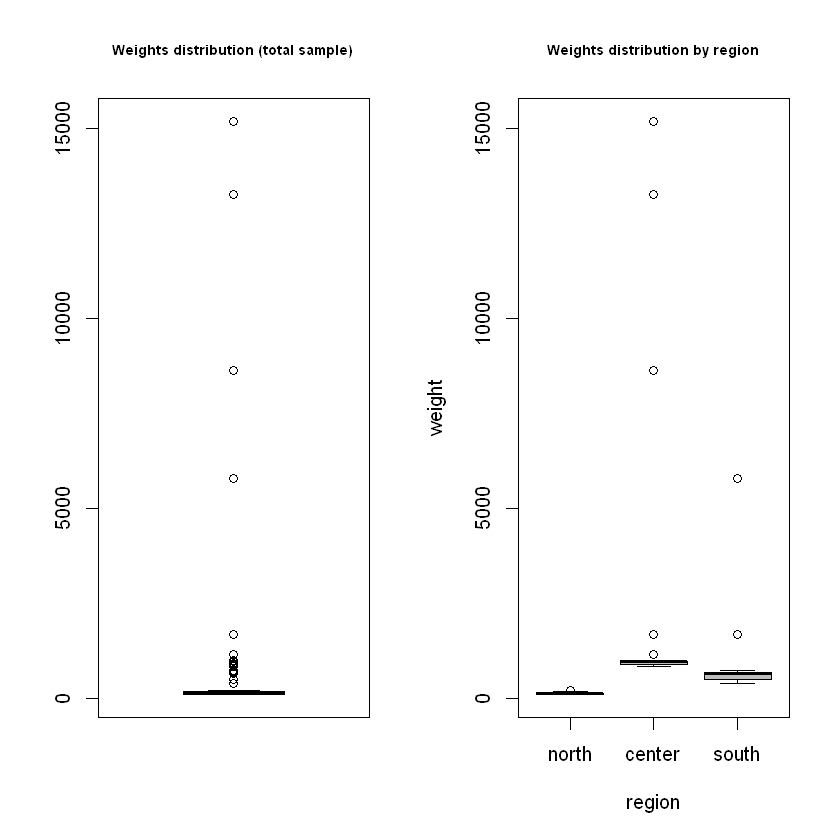
    


    
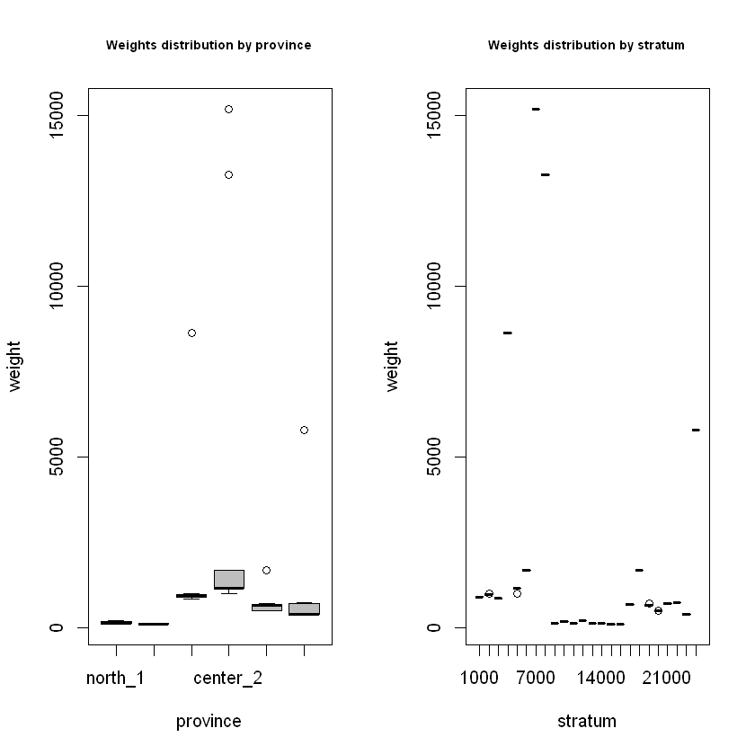
    


## Precision constraints compliance control (by simulation)


```R
df=pop
df$one <- 1
PSU_code="municipality"
SSU_code="id_ind"
target_vars <- c("income_hh",
                 "active",
                 "inactive",
                 "unemployed")  
```


```R
# Domain level = national
domain_var <- "one"
set.seed(1234)
eval <- eval_2stage(df,
                    PSU_code,
                    SSU_code,
                    domain_var,
                    target_vars,
                    PSU_sampled=sample_1st$sample_PSU,
                    nsampl=100, 
                    writeFiles=FALSE,
                    progress=TRUE) 
eval$coeff_var
```

      |======================================================================| 100%
    


<table class="dataframe">
<caption>A data.frame: 1 × 5</caption>
<thead>
	<tr><th scope=col>CV1</th><th scope=col>CV2</th><th scope=col>CV3</th><th scope=col>CV4</th><th scope=col>dom</th></tr>
	<tr><th scope=col>&lt;dbl&gt;</th><th scope=col>&lt;dbl&gt;</th><th scope=col>&lt;dbl&gt;</th><th scope=col>&lt;dbl&gt;</th><th scope=col>&lt;chr&gt;</th></tr>
</thead>
<tbody>
	<tr><td>0.0162</td><td>0.0141</td><td>0.0391</td><td>0.059</td><td>DOM1</td></tr>
</tbody>
</table>


```R
# Domain level = regional
domain_var <- "region"
set.seed(1234)
eval <- eval_2stage(df,
                    PSU_code,
                    SSU_code,
                    domain_var,
                    target_vars,
                    PSU_sampled=sample_1st$sample_PSU,
                    nsampl=100, 
                    writeFiles=FALSE,
                    progress=TRUE) 
eval$coeff_var
```

      |======================================================================| 100%
    


    
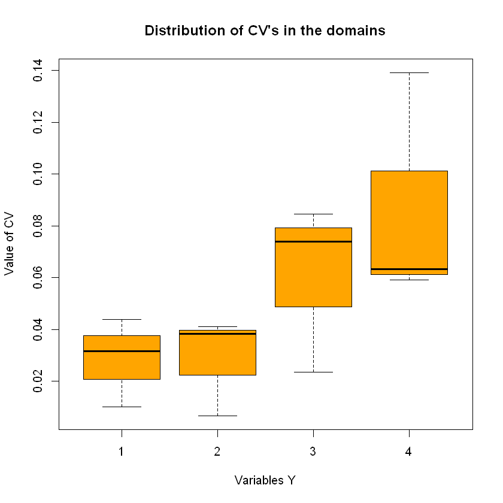
    


<table class="dataframe">
<caption>A data.frame: 3 × 5</caption>
<thead>
	<tr><th scope=col>CV1</th><th scope=col>CV2</th><th scope=col>CV3</th><th scope=col>CV4</th><th scope=col>dom</th></tr>
	<tr><th scope=col>&lt;dbl&gt;</th><th scope=col>&lt;dbl&gt;</th><th scope=col>&lt;dbl&gt;</th><th scope=col>&lt;dbl&gt;</th><th scope=col>&lt;chr&gt;</th></tr>
</thead>
<tbody>
	<tr><td>0.0101</td><td>0.0066</td><td>0.0235</td><td>0.0633</td><td>DOM1</td></tr>
	<tr><td>0.0438</td><td>0.0383</td><td>0.0845</td><td>0.1392</td><td>DOM2</td></tr>
	<tr><td>0.0316</td><td>0.0412</td><td>0.0739</td><td>0.0593</td><td>DOM3</td></tr>
</tbody>
</table>


    
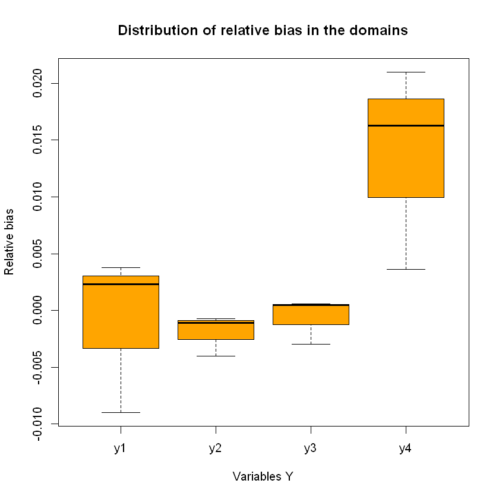
    


```R
alloc$sensitivity
```


<table class="dataframe">
<caption>A data.frame: 4 × 6</caption>
<thead>
	<tr><th></th><th scope=col>Type</th><th scope=col>Dom</th><th scope=col>V1</th><th scope=col>V2</th><th scope=col>V3</th><th scope=col>V4</th></tr>
	<tr><th></th><th scope=col>&lt;chr&gt;</th><th scope=col>&lt;chr&gt;</th><th scope=col>&lt;dbl&gt;</th><th scope=col>&lt;dbl&gt;</th><th scope=col>&lt;dbl&gt;</th><th scope=col>&lt;dbl&gt;</th></tr>
</thead>
<tbody>
	<tr><th scope=row>2</th><td>DOM1</td><td>1</td><td>  1</td><td>0</td><td>  1</td><td>  78</td></tr>
	<tr><th scope=row>6</th><td>DOM2</td><td>1</td><td>  0</td><td>0</td><td>  0</td><td>1495</td></tr>
	<tr><th scope=row>10</th><td>DOM2</td><td>2</td><td>114</td><td>1</td><td>  1</td><td>   7</td></tr>
	<tr><th scope=row>14</th><td>DOM2</td><td>3</td><td>  1</td><td>1</td><td>110</td><td>   1</td></tr>
</tbody>
</table>


```R
save.image(file="R2BEAT_workflows.RData")
```
